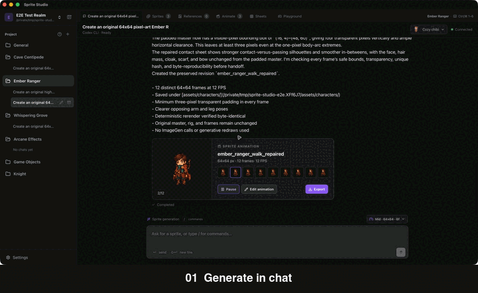
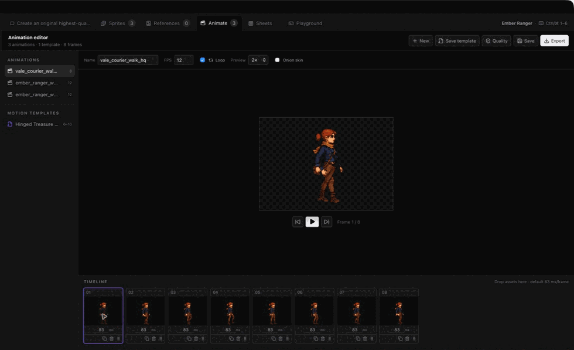
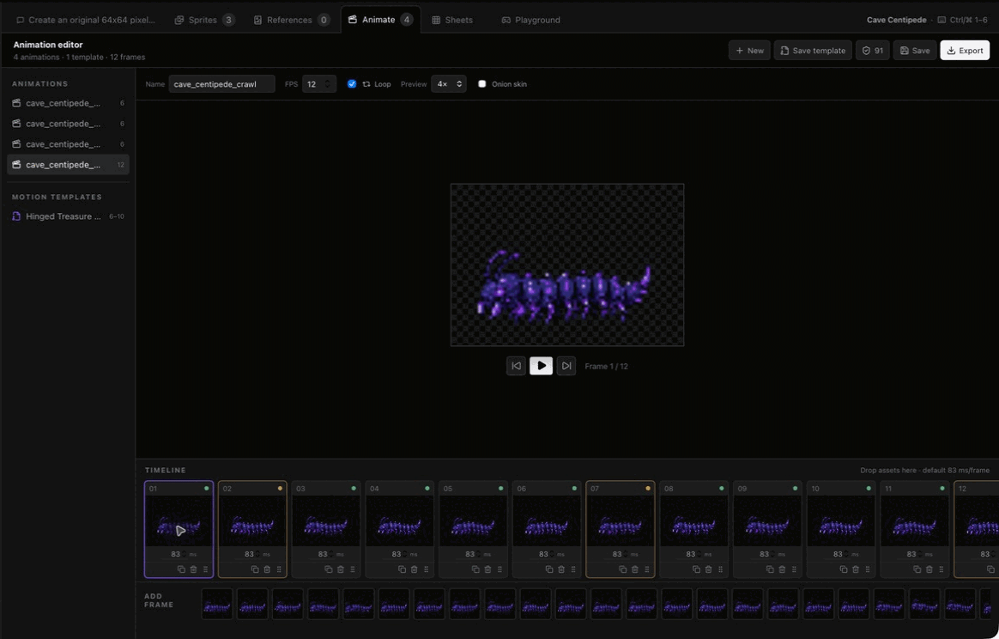
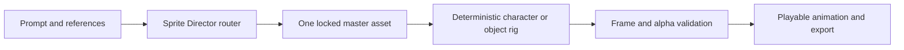

<p align="center">
  
</p>

<p align="center">
  A local-first AI workbench for creating, animating, testing, and exporting 2D game sprites.
</p>

<p align="center">
  <strong>macOS · Windows · Linux</strong>
</p>

<p align="center">
  
</p>

## Why Sprite Studio

Making one attractive image is easy. Making a useful game asset means keeping the same character, proportions, palette, camera, alpha, frame size, and motion across an entire loop.

Sprite Studio keeps that work in one desktop workspace. Describe an asset in chat, review generated frames as one playable set, tune the animation, run it in a lightweight game harness, and export a sheet without losing the source files or conversation that produced it.

The project is open source, local first, and built with Tauri, Svelte, Rust, and SQLite. It does not target Android or iOS.

## The workflow

1. **Generate in chat.** Choose a quality profile, canvas, frame policy, FPS, provider mode, and optional references.
2. **Review one sprite set.** Related frames are grouped behind a single thumbnail and frame-count badge instead of flooding the asset browser.
3. **Tune the loop.** Play, scrub, reorder, retime, zoom, inspect quality warnings, or create a non-destructive repair.
4. **Test in context.** Use the playground to check movement, scale, bounds, pivots, and animation speed before export.
5. **Export for a game.** Build horizontal, vertical, or grid sheets with padding, spacing, scale, pivots, and JSON metadata.

### A real animation in the editor

<p align="center">
  
</p>

### Characters are not the only moving assets

Creature harnesses preserve segmented bodies, leg waves, silhouettes, and ground contact across a full loop. This cave centipede uses 12 distinct crawl frames at 12 FPS.

<p align="center">
  
</p>

## What works today

- Project workspaces with typed **Character**, **Creature**, **Game Object**, **Environment**, **Tileset**, **UI**, and **VFX** worktrees
- A chat-only sidebar with expandable worktrees, per-worktree conversations, rename dialogs, and hover-to-archive actions
- Persistent top tabs for Chat, Sprites, References, Animate, Sheets, and Playground or VFX
- Playable animation cards directly inside chat, with **Edit animation** and **Export** actions
- Chat-local generation settings for quality, dimensions, frames, FPS, model, reasoning effort, and reference images
- Provider capability discovery, so the UI only offers modes reported by the installed provider
- Versioned PNG assets with content hashes and non-destructive revisions
- Reusable motion templates with phases, timing, frame bounds, and reference inheritance
- Cancellable background jobs for generation, analysis, procedural VFX, and sheet export
- Deterministic checks for dimensions, alpha boundaries, duplicates, continuity, alignment, scale, palette, and looping

Quality scores are diagnostics, not artistic judgments. Always inspect playback before accepting a warning or repair.

## Generation profiles

Profiles are useful defaults, not hard limits. Every chat can switch to **Custom** and set its own canvas, frame count, FPS, model, and reasoning level.

| Profile | Canvas | Frames | FPS | Good for |
| --- | ---: | ---: | ---: | --- |
| Low | 32×32 | 4 | 6 | Tiny props, rough ideas, and quick loops |
| Mid | 64×64 | 6 | 8 | Most pixel-art characters and game objects |
| High | 128×128 | 8 | 12 | Detailed characters and smoother motion |
| Custom | 8–512 px | 1–32 | 1–60 | Project-specific pipelines |

Frame selection can be fixed or automatic within a chosen minimum and maximum. The automatic mode may adjust the count when the requested motion needs more poses.

## Slash commands

| Command | Purpose |
| --- | --- |
| `/animate` | Generate a looping animation with the current chat settings |
| `/sprite` | Generate one polished static sprite |
| `/character` | Route the request through the ImageGen character harness |
| `/effect` | Create an animated game effect |

A plain-language prompt still works. The router infers whether it needs the character, creature, game-object, terrain, or effect harness and applies the chat's saved style.

## How generation stays consistent

Sprite Studio separates **master creation** from **motion construction**:



ImageGen can create one new character, creature, or illustrated game-object master. Animation frames are then derived from that locked master with the local rig rather than generated as unrelated images. If an existing asset is supplied as context, it becomes the master and does not need to be regenerated.

## Desktop workbench

The left sidebar is reserved for worktrees and conversations. Asset tools remain open in persistent top-level tabs, so inspecting a sprite never destroys the chat context.

| Tab | Shortcut | Use |
| --- | --- | --- |
| Chat | `Cmd/Ctrl+1` | Prompt, review progress, and play generated sets inline |
| Sprites | `Cmd/Ctrl+2` | Browse grouped static and animated assets |
| References | `Cmd/Ctrl+3` | Manage worktree- and chat-scoped style references |
| Animate | `Cmd/Ctrl+4` | Play, scrub, retime, inspect, and repair loops |
| Sheets | `Cmd/Ctrl+5` | Build sprite sheets and metadata |
| Playground / VFX | `Cmd/Ctrl+6` | Test gameplay or create procedural effects |

## Build from source

### Requirements

- [Bun](https://bun.sh/)
- Stable [Rust](https://www.rust-lang.org/tools/install)
- The native prerequisites required by Tauri 2 for your desktop operating system
- Optional: an installed Codex CLI for live agent conversations and access to its reported models

### Run in development

```bash
bun install
bun run check
bun tauri dev
```

### Verify the native core

```bash
cargo test --manifest-path src-tauri/Cargo.toml
cargo clippy --manifest-path src-tauri/Cargo.toml --all-targets -- -D warnings
```

### Build a desktop bundle

```bash
bun run tauri build
```

Tauri creates the platform-native bundles supported by the machine performing the build. This repository contains no Android or iOS targets.

## Workspace layout

Binary artifacts remain ordinary files below the selected project root, so the workspace can be backed up, inspected, or used by a game engine without a hosted Sprite Studio service.

```text
assets/
  characters/
  terrain/
  props/
  effects/
  references/
  repairs/
  vfx/
animations/
exports/
  sprite-sheets/
.sprite-studio/
  render_sprite.py
  render_layered_sprite.py
  sprite_rig.py
```

SQLite stores project metadata, conversations, worktrees, asset versions, animation timelines, references, templates, jobs, and quality reports. The image files and exports remain in the workspace itself.

## Provider model

Agent providers and image-generation backends are deliberately separate. Codex CLI is the first functional agent adapter. Sprite Studio reads the available model and reasoning modes from the installed provider and does not present unavailable integrations as working features.

## Data safety

- Generated files are registered only after validation.
- Asset changes create content-hashed versions.
- Sheet exports and alignment repairs create new files and records.
- Deleting a sheet removes the sheet revision, not its source frames.
- Quality warnings can be acknowledged or ignored without changing artwork.
- Automatic alignment repair creates a new animation revision instead of overwriting the original.

## Project status

Sprite Studio is an active `0.1.0` alpha. The core desktop workflow works, but file formats, provider adapters, and generation harnesses may still evolve.

## Contributing and recognition

Contributions are welcome. Every accepted commit keeps its Git authorship, while official project roles are curated separately:

- **Project owner:** [@JohnKinyanjui](https://github.com/JohnKinyanjui)
- **Recognized contributors:** added after 10 substantive merged pull requests, or by explicit approval from the project owner
- **Maintainers:** invitation-only and appointed by the project owner

Small fixes are appreciated, but trivial, automated, duplicate, or spam pull requests do not count toward the recognition threshold. See [CONTRIBUTING.md](CONTRIBUTING.md) for the review, quality, and recognition policy.

## License

MIT
# sprite-maker
