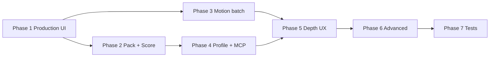
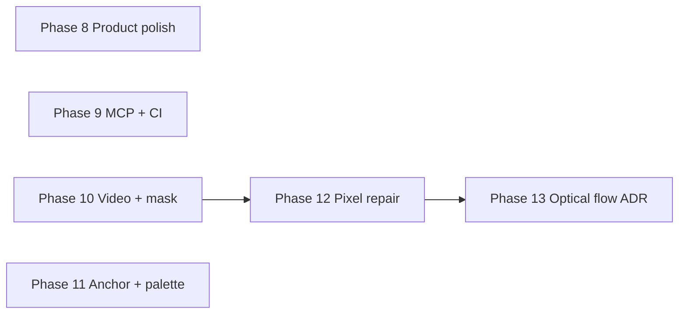

# Competitive Gap Closure Roadmap

Complete implementation plan for every gap identified in the competitive analysis (PerfectPixel, Scenario, PixelLab, Spriterrific). Each phase ends with **verify-until-done**: `cargo test --lib`, `bun run check`, post-task-reviewer, closure report.

## Gap inventory

| ID | Priority | Gap | Phase |
|----|----------|-----|-------|
| G01 | P0 | Production Mode UI (`harden_animation` one-click + options) | 1 |
| G02 | P0 | Character pack export (worktree bundle + manifest) | 2 |
| G03 | P1 | Motion preset catalog + batch queue on anchor | 3 |
| G04 | P1 | Production Score (unified 0–100 dashboard) | 2 |
| G05 | P1 | `clean_alpha` + `snap_to_pixel_grid` in UI / api.ts | 1 |
| G06 | P2 | Character profile sidecar (palette, dHash, rig, families) | 4 |
| G07 | P2 | MCP rig tools parity (`save_rig`, `render_rig_animation`, …) | 4 |
| G08 | P2 | sprite-director SKILL → Rust-native rig only | 4 |
| G09 | P2 | Per-frame scoring post-split (ScoreFrames-style) | 5 |
| G10 | P2 | Facing check UI (`detect_anchor_facing` + history) | 5 |
| G11 | P2 | Video → sprite wizard (guided FPS/layout/normalize) | 5 |
| G12 | P2 | Contract retry native dialog + `score_strip` hints | 5 |
| G13 | P3 | Direction set UI polish (meta-based facings, conversationId warn) | 1 |
| G14 | P3 | Inpainting / multi-frame regional regen | 6 |
| G15 | P3 | Rig keyframe interpolation A→B in editor | 6 |
| G16 | P3 | Optical flow: implement behind feature or document deferral | 6 |
| G17 | P3 | Test automation / fixture contract regression | 7 |

**Non-goals (documented):** cloud custom model training, Midjourney integration.

---

## Phase 1 — Production pipeline UX

**Closes:** G01, G05, G13 (partial)

### Backend

1. **`list_direction_meta` command** — expose `list_direction_meta_for_worktree` for UI facing grid.
2. No changes to `harden_animation` / `clean_alpha` / `snap_to_pixel_grid` (already registered).

### Frontend

1. **`types.ts`** — `HardenAnimationOptions`, `HardenAnimationReport`, `CleanAlphaReport`.
2. **`api.ts`** — `hardenAnimation`, `cleanAlphaAnimation`, `snapToPixelGrid`, `listDirectionMeta`.
3. **`AnimationEditor.svelte`** — Production panel:
   - One-click **Harden** with toggles: clean alpha, normalize, snap grid, grid size, queue contract retry.
   - Standalone **Clean alpha** and **Snap to grid** buttons.
   - Show harden steps + contract result + contract-retry job link.
4. **Direction set polish:**
   - Facing grid uses direction metadata when available (fallback: name suffix).
   - Inline warning when `conversationId` missing and AI facings would be queued.
   - Refresh direction meta after direction_set job completes.

### Tests

- Rust: optional smoke test for `list_direction_meta` (empty worktree).
- Manual: harden on fixture animation; verify steps in notice.

### Verify

- `cargo test --lib` in `src-tauri`
- `bun run check`
- post-task-reviewer

---

## Phase 2 — Export bundle & Production Score

**Closes:** G02, G04

### Backend

1. **`export_character_pack`** command:
   - Input: `workspaceId`, `worktreeId`, `anchorSlug`, `destination`.
   - Output: folder with all facings per direction family, `pack-manifest.json`, preview PNGs, copied anchor reference.
2. **`production_score`** aggregator:
   - Weighted blend: size contract (per animation), character contract (cross-facing), quality report overall score.
   - Return breakdown + single 0–100 score.

### Frontend

1. **AssetInspector / ProjectSidebar** — "Export character pack" with destination picker.
2. **QualityPanel or header badge** — Production Score with expandable breakdown.

### Tests

- Pack export integration test with 2+ facings in fixture worktree.
- Production score unit test with mocked reports.

---

## Phase 3 — Motion presets & batch queue

**Closes:** G03

### Backend

1. **Preset catalog** — JSON in workspace `.sprite-studio/motion-presets.json` (idle, walk, run, attack, hurt, jump).
2. **`queue_motion_batch`** job — for each preset: direction_set or AI strip gen on anchor + harden pipeline.
3. Job progress stages per motion × facing.

### Frontend

1. Motion preset picker in Animation Editor / character worktree sidebar.
2. Batch queue UI with progress table (motion, facing, status).

### Tests

- Job orchestration test (mock provider).
- Preset load/save round-trip.

---

## Phase 4 — Identity, rig agents, SKILL

**Closes:** G06, G07, G08

### Backend

1. **`character-profile.json`** sidecar per anchor: palette, dHash, rig_id, direction families, export/import.
2. **MCP handlers** — `save_rig`, `render_rig_animation`, `suggest_rig_points`, `analyze_rig_fit` (mirror existing Tauri commands).
3. Update **`sprite-director/SKILL.md`** — Rust-native rig path only; deprecate Python `sprite_rig.py`.

### Frontend

1. Character profile panel in AssetInspector (read-only + export/import).
2. Link profile to anchor promotion flow.

### Tests

- MCP schema tests for new rig tools.
- Profile round-trip test.

---

## Phase 5 — Depth UX (facing, video, contract, scoring)

**Closes:** G09, G10, G11, G12, G13 (remainder)

### Backend

1. **`score_animation_frames`** — per-frame metrics after split (motion delta, alpha, size drift).
2. **`list_facing_checks`** — read merged `facing-check.json` history per slug.

### Frontend

1. **Facing panel** — `detect_anchor_facing` report + history timeline.
2. **Video wizard** — multi-step: pick video → FPS → `score_sprite_strip` → layout → extract → normalize → harden.
3. **ContractRetryDialog.svelte** — replace `window.prompt` for finalize strip; embed `score_strip` hints.
4. Direction set: full meta-based status (pending / mirrored / AI-generated badges).

### Tests

- Frame scoring on walk fixture strip.
- Facing check list command test.

---

## Phase 6 — Advanced pipeline

**Closes:** G14, G15, G16

### Backend

1. **Regional regen** — mask-based frame edit job (provider + import).
2. **Rig interpolation** — `interpolate_rig_frames(from, to, steps)` + render.
3. **Optical flow** — either wire `optical-flow` feature with `raflow`/`opencv` or remove empty feature + document in competitive-pipeline.md.

### Frontend

1. Frame mask selection + "Regen region" in editor.
2. Rig editor: select keyframe A/B → interpolate.

### Tests

- Interpolation produces N frames.
- Feature flag documentation test / compile check.

---

## Phase 7 — Test automation

**Closes:** G17

1. Enable `pipeline_e2e` fixture test (or split into focused integration tests).
2. Contract regression suite on `test-fixtures/strips/`.
3. CI workflow: `cargo test --lib` + optional e2e on Linux/macOS.

### Verify (final)

- Full gap audit: every G01–G17 marked proven.
- Adversarial review if post-task-reviewer escalates.
- Goal `complete` + Italian closure report.

---

## Dependency graph

Phase 1 is the foundation for harden-in-batch (Phase 3) and production score inputs (Phase 2).

---

# Phase 8–13 — Residual competitive gaps (G18–G29)

Second roadmap cycle after G01–G17 closure. Identified from the post-closure competitive analysis (PerfectPixel, PixelLab, Scenario, Spriterrific). Same verify-until-done gate per phase: `cargo test --lib`, `bun run check`, post-task-reviewer, Italian closure report.

Italian summary + per-phase status: [roadmap-gap-residui.md](../it/roadmap-gap-residui.md).

**Do not merge or split these six phases.** Phases 8–11 may run in parallel (no code dependency). Do not fold G28 out of Phase 8 (it hooks the same `last-generation.json` writes). Do not add a seventh phase.

## Decisions (closed)

| ID | Choice |
|----|--------|
| D1 | **G29 Path B** — permanent deferral. Remove the empty `optical-flow` Cargo feature; document rig bridge + motion-aware midpoint + G27 rig-rendered in-betweens as the transition path. Do not add `raflow`/`opencv`. |
| D2 | **G19 GIF is the gate.** `image` 0.25 already has the `gif` feature. APNG is out of this cycle (no APNG encoder in tree). Pack toggle is GIF-only; keep PNG stills. |
| D3 | **Production gallery** is a new Media Gallery tab (`MediaNavigation` item `sessions`), not Arts (art styles) and not a new primary nav. Replay opens the animation in the editor. |
| D4 | **`quantize_rgba_palette` is grid-channel snap, not a color LUT.** G25 adds a new `apply_shared_palette` (histogram / median-cut to N colors). Do not reuse snap-grid quantization. UI color counts: **8 / 16 / 32** (not 64). |
| D5 | **Anchor `view` strings stay the persisted API:** `side`, `top_down`, `isometric`, plus new `rts_oblique`. UI preset `side_platformer` maps to `"side"`. Do not rename existing `"side"` in sidecars. `rts_oblique` canonical facing = `w`; `baselineYOffset = 0`, `centroidBiasX = 0` (same pivot math as side until a fixture exists). |
| D6 | **Regional regen mask is raster.** Brush stamps + rect rasterize to the existing white/black `RgbaImage` used by `build_region_mask`. Optional `brushStrokes: [{x,y,radius}]` on `QueueRegionRegenInput`. No TypeScript union of rect\|polygon. Polygon is out of this cycle. |
| D7 | **`AnimationEditor.svelte` is already oversized (~6k lines).** New UI lands in extracted components; do not grow the editor file except thin wiring. |
| D8 | **G20 CI** adds `production_score_fixture_gate` to existing `fixture_regression_tests.rs` (already run by `rust-pipeline-e2e`). Do not add a third Ubuntu Rust job. Threshold `PRODUCTION_SCORE_CI_MIN = 60`. |
| D9 | **`onlyMissing`** skips a catalog motion when the worktree already has a canonical-facing animation for that `direction_family` whose latest size contract passed. No contract row → treat as missing. Reuse `find_motion_source` in `motion_batch.rs` (canonical `w` for side / `n` for top-down). |
| D10 | **Video step 4** extracts first (existing `extract_video_frames` indexes PNGs), then curates. `persistImportedFrames` receives only selected `assetIds`. Unselected imports stay on disk under `assets/imports/` (no auto-delete). |
| D11 | **Paint restore** copies the previous `asset_versions` PNG over the live asset path and `upsert`s with `change_kind: "paint_restore"`. New command `restore_asset_version(assetId, versionId)` if restore is not already a command. |
| D12 | **MCP Phase 9 wraps today’s Tauri inners** (`queue_motion_batch_inner`, etc.). It does not wait for Phase 8 catalog v2 or GIF. New MCP params stay camelCase like existing tools. |

**Open:** none.

## Extra non-goals (this cycle)

Unchanged: cloud custom model training, tilemap/world generation, bundled image providers, Midjourney.

Also out: PerfectPixel full perceptual-hash scoring (beyond existing `score_animation_frames`), PixelLab skeleton inpainting UI, APNG, optical-flow crate, new MCP tools beyond the seven listed in G21, `list_motion_presets` MCP.

## Residual gap inventory

| ID | Priority | Gap | Phase |
|----|----------|-----|-------|
| G18 | P1 | Motion catalog UX — categories, expanded presets, “generate all missing” | 8 |
| G19 | P1 | Animated preview export (GIF) in character pack and single animation (APNG deferred) | 8 |
| G20 | P1 | Production Score CI gate on fixture worktree | 9 |
| G21 | P1 | MCP parity for batch / regen / pack / score / rig interpolate | 9 |
| G22 | P2 | Visual region mask on canvas (brush + rect overlay) for regional regen | 10 |
| G23 | P2 | Frame picker from dense video extraction (smart subsample + curation UI) | 10 |
| G24 | P2 | Game-view anchor presets (platformer side, top-down, RTS oblique) | 11 |
| G25 | P2 | Worktree shared-palette quantization pass (PerfectPixel-style) | 11 |
| G26 | P2 | Non-destructive pixel cleanup (alpha brush / eraser on frame) | 12 |
| G27 | P3 | Rig-rendered pixel in-between frames (complement pose interpolation) | 12 |
| G28 | P3 | Production session gallery (generation archive + replay per worktree) | 8 |
| G29 | P3 | Optical flow — permanent deferral ADR (Path B); remove empty feature flag | 13 |

**Non-goals (unchanged):** cloud custom model training, tilemap/world generation, bundled image providers (Gemini/OpenRouter), Midjourney integration. See Extra non-goals above.

---

## Phase 8 — PerfectPixel product polish

**Closes:** G18, G19, G28

### Backend

1. **Motion preset catalog v2** — `src-tauri/src/models/pipeline.rs` (`MotionPreset.category: String`, serde default `"locomotion"`), `src-tauri/src/pipeline/motion_presets.rs` (`CATALOG_VERSION = 2`).
   - Categories: `locomotion`, `combat`, `reaction`, `interaction`.
   - Keep the existing 6 presets; add:

   | id | category | frames | fps | looping |
   |----|----------|--------|-----|---------|
   | crouch | locomotion | 4 | 8 | true |
   | climb | locomotion | 6 | 10 | true |
   | cast | combat | 6 | 12 | false |
   | block | combat | 4 | 10 | false |
   | death | reaction | 6 | 8 | false |
   | pickup | interaction | 4 | 10 | false |
   | throw | interaction | 6 | 12 | false |

   Existing map: idle/walk/run/jump → locomotion; attack → combat; hurt → reaction.
   - **v1 on-disk catalogs:** if `version < 2`, assign categories by id map, append missing default ids, write version 2. Do not wipe user `enabled` / custom presets.
   - **`list_missing_motions(workspaceId, worktreeId, anchorSlug)`** Tauri command (D9). Register in `pipeline/mod.rs` + `lib.rs`.
2. **`QueueMotionBatchInput.only_missing: Option<bool>`** (default false). When true, filter through `list_missing_motions` before queueing (`motion_batch.rs`). Empty missing set → error `no_missing_motions`, do not queue.
3. **`export_animation_preview`** — new `src-tauri/src/animations/preview.rs`:
   - Input: `animationId`, `destination?`, `format: "gif"` (reject other formats).
   - `image::codecs::gif::GifEncoder` + `Repeat::Infinite`; delay = `100 / fps` centiseconds (min 2). 256-color map; alpha 0 → transparent index.
   - **`ExportCharacterPackInput.include_animated_previews: Option<bool>`** (default false). When true, write `previews/<family-facing>.gif` beside the PNG still; manifest `previewAnimated`. `character_pack.rs`.
   - Do not mix GIF into `export_animation` engine JSON formats.
4. **Session gallery** — new `src-tauri/src/pipeline/sessions.rs`:
   - Workspace file `.sprite-studio/generation-sessions.json` (`version: 1`, `sessions[]`): `sessionId`, `worktreeId`, `kind`, `animationId?`, `manifestPath`, `thumbnailPath?`, `score?`, `createdAt`.
   - Append in `assets::scan::write_generation_manifest` and on job complete for `motion_batch`, `contract_retry`, `region_regen`. Cap 200 (drop oldest).
   - Command: `list_generation_sessions(workspaceId, worktreeId?)`.

### Frontend

Extract; wire from `AnimationEditor.svelte` / `+page.svelte` only (D7).

| File | Owner |
|------|--------|
| `src/lib/components/MotionBatchPanel.svelte` **create** | G18 tabs, search, missing badges, `onlyMissing`, existing progress table |
| `src/lib/components/CharacterPackExportDialog.svelte` **create** | G19 GIF toggle + destination |
| `src/lib/components/ProductionSessionsGallery.svelte` **create** | G28 timeline; replay → open animation |
| `src/lib/components/MediaNavigation.svelte` **edit** | Tab `{id:"sessions", label:"Sessions"}` (D3) |
| `src/lib/types.ts`, `src/lib/api.ts` | `category`, `onlyMissing`, `includeAnimatedPreviews`, `exportAnimationPreview`, `listGenerationSessions`, `listMissingMotions` |

### Tests

- `motion_presets_tests.rs`: v2 ≥13 presets / 4 categories; v1 migrates; missing-motions sees walk after fixture save.
- GIF round-trip on walk fixture: file exists, cell size matches, ≥2 frames.
- `write_generation_manifest` grows `generation-sessions.json`.

### Edges

- Missing catalog file → defaults v2.
- 1-frame animation still writes a 1-frame GIF.
- Pack toggle off = today’s PNG-only previews.

### Verify

- `cargo test --lib` in `src-tauri`
- `bun run check`
- post-task-reviewer
- Italian status: Fase 8 chiusa

---

## Phase 9 — Agent automation & CI gates

**Closes:** G20, G21

**May start in parallel with Phase 8.** The seven Tauri commands already existed; MCP (`schema.rs` / `mcp/tests.rs`) now exposes all of them (closed Phase 9).

### Backend — MCP tools

Mirror inners (same pattern as `harden_animation` / `save_rig`):

| MCP tool | Inner | Notes |
|----------|-------|--------|
| `queue_motion_batch` | `queue_motion_batch_inner` | `app: None`; poll `get_job` |
| `queue_region_regen` | `queue_region_regen_inner` | Requires `conversationId` |
| `export_character_pack` | `export_character_pack_inner` | Headless `destination` required |
| `get_production_score` | `production_score_inner` | |
| `interpolate_rig_frames` | `rig::interpolate_rig_frames_inner` | Full `RigInput` body |
| `score_animation_frames` | `score_animation_frames_inner` | |
| `list_facing_checks` | `list_facing_checks_inner` | |

Files: `src-tauri/src/mcp/schema.rs`, `handlers.rs`, `tests.rs`. Docs: `docs/en/mcp-reference.md`, `docs/it/riferimento-mcp.md`. SKILL.md: agents may `queue_motion_batch` then `export_character_pack`. Optional Phase 8 fields default like Tauri.

### Backend — CI production score gate

1. `production_score_fixture_gate` in `src-tauri/src/pipeline/fixture_regression_tests.rs`: walk strip + normalize + `production_score_inner`; `overall_score >= PRODUCTION_SCORE_CI_MIN` (`60`).
2. Document threshold in `src-tauri/test-fixtures/README.md`. Existing CI job `rust-pipeline-e2e` already runs `fixture_regression` — **no new workflow job** (D8).

### Frontend

- None.

### Tests

- MCP schema includes all 7 names.
- Fixture gate on `walk-4-horizontal.png`.

### Verify

- `cargo test --lib` / `bun run check` / post-task-reviewer
- Italian: Fase 9 chiusa

---

## Phase 10 — Video curation & visual regional regen

**Closes:** G22, G23

### Backend

1. **`subsample_video_frames`** — `src-tauri/src/pipeline/strip.rs` beside `extract_video_frames_inner`:
   - Input: `workspaceId` + extracted `assetIds`; `minDelta` default `0.02`; `stride` default `1`.
   - Keep if first/last, or `index % stride == 0`, or opaque-pixel change vs last kept > `minDelta`.
   - Return `{ keptAssetIds, droppedAssetIds, keptIndices, droppedIndices }`.
2. **Mask input (D6)** — `QueueRegionRegenInput.brush_strokes: Vec<BrushStamp> { x, y, radius }` default empty. Rasterize white disks **union** existing rects in `build_region_mask`. Rect-only callers unchanged. No polygon type.
3. Best-effort overlay JSON `.sprite-studio/masks/<animationId>-<frameIndex>.json` after queue; failure does not fail the job.

### Frontend

| File | Owner |
|------|--------|
| `src/lib/components/FrameMaskOverlay.svelte` **create** | Overlay on AnimationEditor `.preview-stage` (not `TestRoom` Playground, not `SpriteViewer`). Tools: rect (sync numeric X/Y/W/H), brush, clear. |
| `src/lib/components/AnimationEditor.svelte` **thin wire** | Keep numeric fields; overlay drives them. |
| `src/lib/components/VideoImportWizard.svelte` | Step 4 of 4 after extract (header is “Step x of 3” today). Filmstrip, auto-subsample, keep/drop; `onComplete(selectedIds, options)` (D10). |
| `src/lib/api.ts` / `types.ts` | `subsampleVideoFrames`, `BrushStamp` |

### Tests

- Synthetic 8-frame sequence (7 identical + 1 different): subsample keeps first, last, and the changed frame.
- `build_region_mask` with one stamp paints white; empty stamps+rects still `empty_mask`.
- Wizard: selected subset is what `onComplete` receives (Rust subsample is the automated gate if no component harness).

### Edges

- Regen stays disabled without `conversationId`.
- Brush outside frame: clip.
- Extract failure: stay on step 3.

### Verify

- `cargo test --lib` / `bun run check` / post-task-reviewer
- Italian: Fase 10 chiusa

---

## Phase 11 — Anchor presets & shared palette

**Closes:** G24, G25

### Backend

1. **View presets (D5)** — `src-tauri/src/pipeline/facing.rs`:
   - `top_down` | `isometric` → canonical `"n"`.
   - `side`, `rts_oblique`, omitted → `"w"`.
   - Aliases: UI `side_platformer` persists `"side"`; `top-down` persists `"top_down"`.
   - `rts_oblique` facing detection uses the **side** left/right branch. Pivot offsets 0 (same as side).
2. **Promote UI is the gap.** `promote_anchor` already takes `view`. `AssetInspector.svelte` hardcodes `"side"` today.
3. **`quantize_worktree_palette`** — new `src-tauri/src/pipeline/shared_palette.rs`. Do **not** call `quantize_rgba_palette` (that is grid-channel snap in `snap_grid.rs`).
   - Collect opaque RGB across worktree frames (optional `anchorSlug` family).
   - Palette size `colorCount` ∈ {8,16,32}, default 32; map opaque pixels to nearest; **alpha 0 unchanged**.
   - Write PNGs + `upsert(..., "palette_quantize")`.
   - Report: `uniqueColorsBefore`, `uniqueColorsAfter`, `framesTouched`, `palette` hex list.
4. **`HardenAnimationOptions.quantize_palette` + `palette_color_count`**. After snap-grid, if true, run shared palette on that animation only (`harden.rs`).

### Frontend

| File | Owner |
|------|--------|
| `src/lib/components/PromoteAnchorDialog.svelte` **create** | Four presets (CSS diagrams OK). |
| `src/lib/components/AssetInspector.svelte` | Open dialog instead of hardcoded `"side"`. |
| Production panel (extracted or thin editor wire) | Shared palette + 8/16/32 select. |

### Tests

- `canonical_facing_for_view("rts_oblique") == "w"`; `"top_down" == "n"`; alias persists `side`.
- Palette pass: opaque unique count drops; transparent pixels stay alpha 0.
- Reject `colorCount` other than 8/16/32; empty worktree → `empty_worktree`.

### Verify

- `cargo test --lib` / `bun run check` / post-task-reviewer
- Italian: Fase 11 chiusa

---

## Phase 12 — Manual pixel repair & rig in-betweens

**Closes:** G26, G27

Depends on Phase 10 `FrameMaskOverlay` (reuse in erase mode).

### Backend

1. **`paint_frame_alpha`** — new `src-tauri/src/pipeline/paint.rs`:
   - Input: `assetId`, `strokes: [{x,y,radius}]`, `mode: "erase" | "restore"`.
   - Erase: alpha 0 on stamp disks; write PNG; `upsert` `change_kind: "paint_erase"`.
   - Restore: copy previous `asset_versions` PNG (or `versionId`) over the live path; `upsert` `paint_restore`. Add `restore_asset_version` if no restore command exists (D11).
2. **`interpolate_rig_animation_frames`** — extend `src-tauri/src/rig/interpolate.rs` without replacing pose-only `interpolate_rig_frames` (G15):
   - Input: `rig`, `fromIndex`, `toIndex`, `steps`, `animationId?`, `workspaceId`, `worktreeId`.
   - For each in-between t: `interpolate_rig_frame_at` → `render_rig_frames_blocking` → import PNG → insert into animation frames.
   - If `steps > 8`, queue job `kind: "rig_interpolate_render"` and return `jobId`; else sync.

### Frontend

| File | Owner |
|------|--------|
| `src/lib/components/FrameCleanupToolbar.svelte` **create** | Eraser, undo = restore last version |
| `FrameMaskOverlay.svelte` | Mode `erase` vs `regen` |
| `src/lib/components/RigEditor.svelte` | “Insert rendered in-betweens” after A→B interpolate |

### Tests

- Erase decreases opaque count; restore returns previous content hash.
- N new assets; animation frame count increases by N.
- `steps == 0` or no prior version → error.

### Verify

- `cargo test --lib` / `bun run check` / post-task-reviewer
- Italian: Fase 12 chiusa

---

## Phase 13 — Optical flow deferral & competitive doc refresh

**Closes:** G29 (Path B, Decision D1)

### Backend

- Remove `optical-flow = []` from `src-tauri/Cargo.toml`.
- `src-tauri/src/pipeline/optical_flow.rs`: `optical_flow_enabled() -> false`; status documents permanent deferral (rig bridge + motion-aware midpoint + G27 in-betweens).
- `optical_flow_tests.rs`: assert disabled; drop `cfg!(feature = "optical-flow")` compile assertion.

### Docs

- `docs/en/competitive-pipeline.md` + `docs/it/pipeline-competitiva.md`: G18–G29 matrix; optical flow → deferred permanently.
- This file: mark phases closed when proven.
- `src-tauri/resources/skills/sprite-director/SKILL.md`: missing-motions batch, GIF pack flag, G21 MCP names, G27 render in-betweens. No optical-flow agent path.

### Tests

- Lib tests compile without the feature; status test updated.

### Verify (final cycle)

- Full audit G18–G29 proven; G29 Path B deferred.
- `cargo test --lib` + `bun run check`
- post-task-reviewer; adversarial review if escalated.
- Goal `complete` + Italian closure report in `docs/it/roadmap-gap-residui.md`

---

## Dependency graph (Phase 8–13)

- **8, 9, 10, 11 start immediately** (parallel). G21 does not need catalog v2 or GIF.
- **12 after 10** so `FrameMaskOverlay` exists for the eraser. G27 does not need 10; still ship both in 12.
- **13 after 12** so the ADR can cite G27 as shipped.
- Do **not** merge or split these six phases. Do not add a `rust-production-gate` workflow job.

## Implementation todos

- [ ] Phase 8: catalog v2 + `list_missing_motions` + `onlyMissing` + GIF preview + session index + extracted UI
- [x] Phase 9: 7 MCP tools + fixture production score ≥ 60 + docs
- [x] Phase 10: `FrameMaskOverlay` + brush stamps on regen + video wizard step 4
- [x] Phase 11: promote dialog 4 views + `apply_shared_palette` + harden option
- [x] Phase 12: `paint_frame_alpha` + rig-rendered in-betweens
- [x] Phase 13: Path B feature removal + competitive matrix

## Acceptance (residual cycle)

| Phase | Must be true |
|-------|----------------|
| 8 | ≥13 presets in 4 categories; `onlyMissing` skips passing canonical-facing motions; pack toggle writes GIF under `previews/`; Sessions tab lists sessions |
| 9 | 7 MCP tools in schema tests + mcp-reference; fixture `overallScore >= 60` in existing e2e job |
| 10 | Brush+rect mask queued to `queue_region_regen`; wizard filmstrip persists only selected ids |
| 11 | Four view presets in promote UI; shared palette reduces opaque unique colors; alpha 0 preserved |
| 12 | Erase creates a new asset version; restore recovers; rig in-betweens add N PNG frames |
| 13 | No `optical-flow` feature; competitive docs mark G29 deferred; G18–G28 proven |

## Edges (cross-phase)

- Headless MCP jobs: `AppHandle` is `None`; progress still in SQLite (`get_job`).
- `export_character_pack` still blocks on failed character contract.
- Windows: GIF encoder and palette pass must not require extra native deps.
- Italian UI strings stay Italian; new identifiers English.

