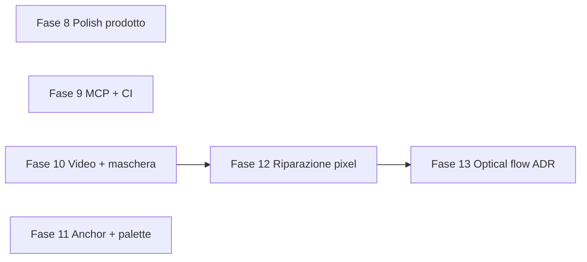

# Roadmap gap residui (Fase 8–13)

Piano di implementazione per **tutti** i gap competitivi residui dopo la chiusura G01–G17. Stesso flow delle fasi precedenti: **verify-until-done** (`cargo test --lib`, `bun run check`, post-task-reviewer, report di chiusura in italiano).

HOW canonico (file, API, decisioni): [gap-closure-roadmap.md](../en/gap-closure-roadmap.md) (sezione Phase 8–13). **Non unire né spezzare** le sei fasi. Le fasi 8–11 possono partire in parallelo.

## Decisioni chiuse (allineate all’inglese)

| ID | Scelta |
|----|--------|
| D1 | G29 **Path B**: deferral permanente optical flow; togliere il feature flag vuoto. Nessun crate `raflow`/`opencv`. |
| D2 | G19: **solo GIF** (APNG fuori ciclo). |
| D3 | Gallery sessioni = tab Media Gallery `sessions` (non Arts, non nuova nav primaria). |
| D4 | Palette condivisa = nuova `apply_shared_palette`, **non** `quantize_rgba_palette`. Contatori UI 8/16/32. |
| D5 | `view` persistito: `side` / `top_down` / `isometric` / `rts_oblique`. UI “side platformer” → `"side"`. RTS oblique = facing `w`, offset 0. |
| D6 | Maschera regen = raster (rect + brush stamps). Niente poligoni. |
| D7 | Nuova UI in componenti estratti; `AnimationEditor.svelte` solo wiring. |
| D8 | Gate score in `fixture_regression_tests.rs` (job CI già esistente). Soglia 60. Nessun job `rust-production-gate`. |
| D9 | `onlyMissing` salta motion con facing canonico e size contract già passato. |
| D10 | Wizard video: extract poi curatela; persist solo `assetIds` selezionati. |
| D11 | Restore paint da `asset_versions`. |
| D12 | MCP Fase 9 wrappa gli inner Tauri già esistenti; non attende la Fase 8. |

**Open:** nessuno.

## Inventario gap residui

| ID | Priorità | Gap | Fase |
|----|----------|-----|------|
| G18 | P1 | Catalogo motion UX — categorie, preset estesi, “genera tutti i mancanti” | 8 |
| G19 | P1 | Export preview animate (GIF) nel character pack (APNG rimandato) | 8 |
| G20 | P1 | Soglia Production Score in CI su fixture | 9 |
| G21 | P1 | Parità MCP: batch, regen, pack, score, interpolate rig, score frames, facing checks | 9 |
| G22 | P2 | Maschera visiva su canvas (brush + rettangolo) per regional regen | 10 |
| G23 | P2 | Frame picker da estrazione video densa (subsample + curatela) | 10 |
| G24 | P2 | Preset game-view anchor (platformer, top-down, RTS oblique) | 11 |
| G25 | P2 | Quantizzazione palette condivisa worktree | 11 |
| G26 | P2 | Pixel cleanup non distruttivo (gomma / brush alpha) | 12 |
| G27 | P3 | In-between pixel da rig renderizzato | 12 |
| G28 | P3 | Gallery sessioni produzione (archivio generazioni per worktree) | 8 |
| G29 | P3 | Optical flow — deferral definitivo (Path B) | 13 |

**Non-goal (invariati):** training modelli cloud, tilemap/mondo, provider immagine integrati, Midjourney.

Anche fuori ciclo: scoring percettivo PerfectPixel completo, inpainting scheletro PixelLab, APNG, crate optical-flow, tool MCP oltre i 7 di G21.

## Riepilogo fasi

| Fase | Gap | Contenuto principale |
|------|-----|-------------------|
| **8** | G18, G19, G28 | Catalogo motion v2 (≥13 preset / 4 categorie), batch `onlyMissing`, export GIF, gallery sessioni (tab Media) |
| **9** | G20, G21 | 7 tool MCP, gate CI production score ≥ 60 sulla fixture (job e2e esistente) |
| **10** | G22, G23 | Overlay canvas + brush stamps, subsample video + filmstrip wizard step 4 |
| **11** | G24, G25 | Dialog promote 4 view, `apply_shared_palette` (8/16/32) |
| **12** | G26, G27 | Gomma alpha versionata, in-between rig → frame PNG |
| **13** | G29 | Path B: rimuovere feature `optical-flow` + matrice competitiva |

## Stato

- **Fase 8:** completata (2026-09-14) — G18 catalogo motion v2 + `onlyMissing`, G19 export GIF (singolo + pack), G28 gallery sessioni (tab Media). Verifica: `cargo test --lib` 274 test, `bun run check` OK, post-task-reviewer.
- **Fase 9:** completata (2026-09-14) — G21 sette tool MCP (`queue_motion_batch`, `queue_region_regen`, `export_character_pack`, `get_production_score`, `interpolate_rig_frames`, `score_animation_frames`, `list_facing_checks`); G20 gate CI `production_score_fixture_gate` ≥ 60 su `walk-4-horizontal.png`.
- **Fase 10:** completata (2026-09-14) — G22 overlay rect/brush + `queue_region_regen.brushStrokes`, G23 wizard video 4 step con subsample/filmstrip.
- **Fase 11:** completata (2026-09-14) — G24 `PromoteAnchorDialog` (4 view + alias), G25 `quantize_worktree_palette` + opzione harden palette 8/16/32.
- **Fase 12:** completata (2026-09-14) — G26 `paint_frame_alpha` + restore versioni, G27 `interpolate_rig_animation_frames` con UI rig.
- **Fase 13:** completata (2026-09-14) — G29 Path B: feature `optical-flow` rimossa, deferral permanente documentato.

## Dipendenze

Le fasi **8–11** partono subito. La **12** riusa l’overlay della 10. La **13** cita G27 già shippato.

## Gate per fase (invariato)

1. `cargo test --lib` in `src-tauri`
2. `bun run check`
3. post-task-reviewer
4. Report chiusura IT nella sezione Stato di questo file

## Criteri di accettazione per fase

### Fase 8
- Catalogo ≥13 preset in 4 categorie
- `onlyMissing` salta motion con facing canonico e contract passato
- Character pack con toggle scrive GIF in `previews/`
- Tab Sessions mostra sessioni con thumbnail e link animazione

### Fase 9
- Tutti e 7 i tool MCP in schema test + `mcp-reference`
- Fixture `overallScore >= 60` nel job `rust-pipeline-e2e` esistente (non un nuovo job)

### Fase 10
- Brush + rect rasterizzati verso `queue_region_regen`
- Wizard video a 4 step: filmstrip dopo extract, persist solo id selezionati

### Fase 11
- 4 preset view nel dialog promote (side persistito come `"side"`)
- Palette condivisa riduce colori opachi unici; alpha 0 intatto

### Fase 12
- Gomma crea nuova versione asset recuperabile
- Interpolate rig produce N frame PNG in animazione

### Fase 13
- Nessun feature `optical-flow`; docs competitive con G18–G29
- G29 Path B deferral esplicito
